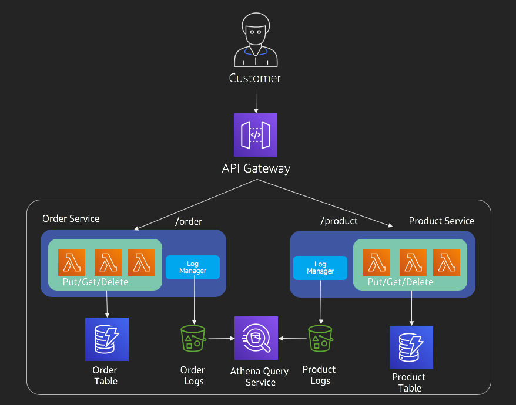
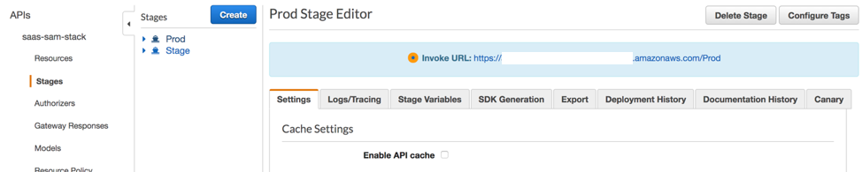
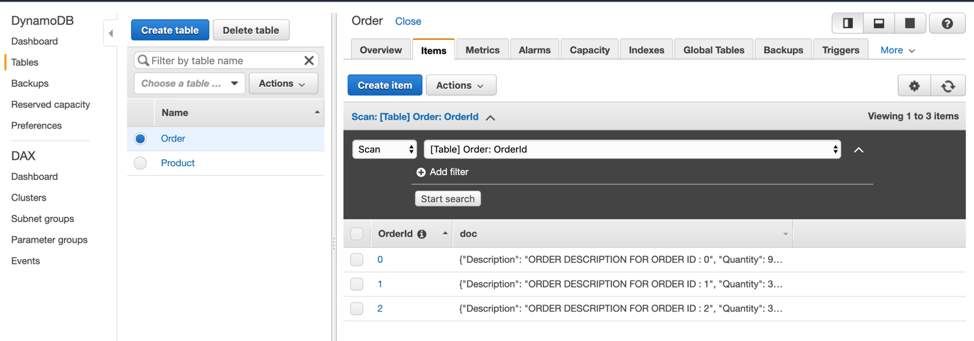
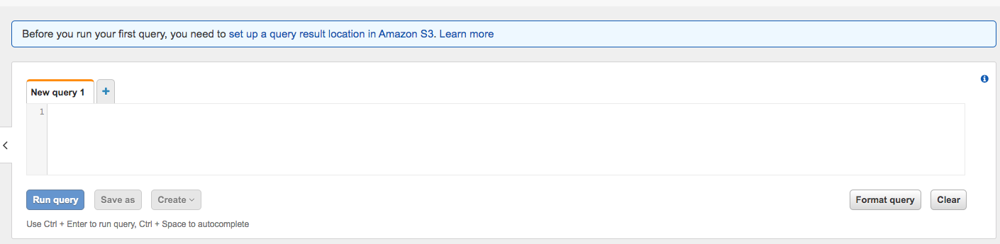
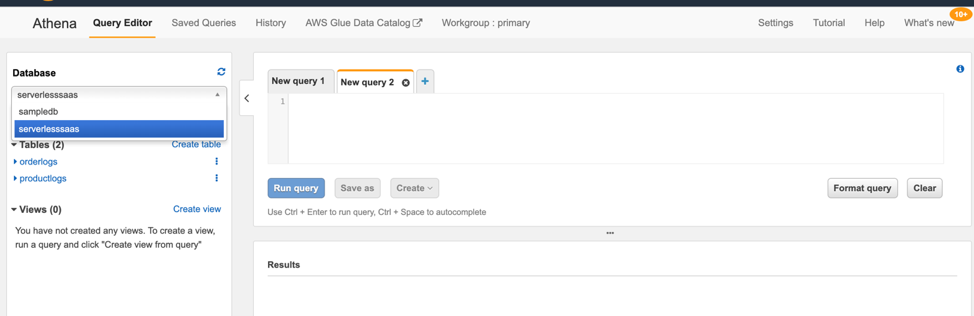
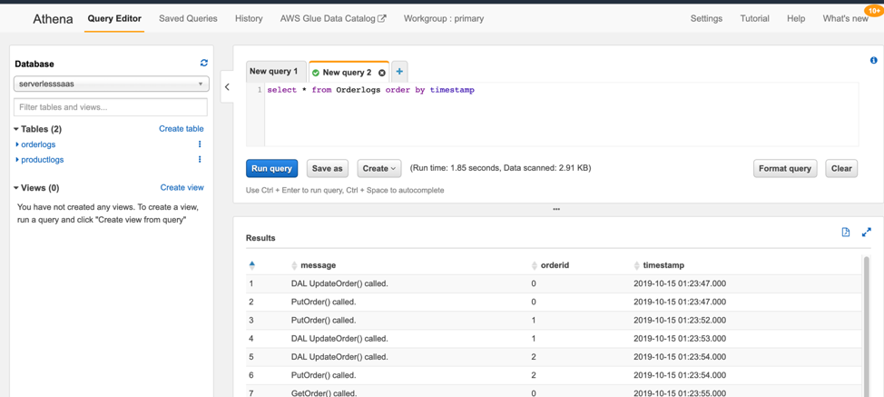

# Lab1 – Starting with a single-tenant serverless solution

Before we can start digging into the details of the multi-tenant developer experience, we need to deploy a single-tenant serverless solution. This solution will serve as the baseline version that we will then slowly migrate into a multi-tenant environment, that leverages layers to simplify and streamline the overall SaaS developer experience. This exercise will also get your familiar with the basic moving parts of the environment, the deployment mechanisms, and so on.

<b>Step 1</b>: To get started, we’ll need to login to the AWS console. 

    NOTE: If you are doing this lab as part of an AWS event, then you will be using an account that will be provisioned for you as part of this experience. 
    It’s essential that you logout of any other AWS accounts you may be actively using and use the account provisioned for you. 

Much of the work that we’ll be doing in this lab will use the AWS Cloud9 IDE. This IDE will give us access to the code and provide us with a terminal window that will be used to invoke various commands as part of the overall experience. To open the AWS Cloud9 IDE, you first navigate to the AWS Cloud9 service and inside “Your environments” click on “Open IDE” inside "Serverless-SaaS" environment. This will launch the AWS Cloud9 IDE.

<b>Step 2</b>: Once you’re in AWS Cloud9 IDE, expand the serverless-saas-layers folder. Navigate to Lab1. Under this folder you’ll find the client and server folders for our Lab 1 solution. This folder holds all the information we’ll need for Lab 1. 

Our first step is to get the lambda functions of our service deployed and running. To achieve this, we’ll run some provided scripts that will automate this deployment. To run this command, we’ll need to open a terminal window in the IDE. Select “Window” and “New Terminal” in AWS Cloud9. 

In the terminal window, change the current directory to “serverless-saas-layers/Lab1”. Run the below two commands to deploy the CloudFormation for this stack. Wait for this command to finish.

```
chmod +x server_deploy.sh
. server_deploy.sh
```

This step can take up to 3-4 mins to complete. Once this has been completed, the following infrastructure will be deployed:

<p align="center"></p>

<b>Step 3</b>: We will now need the URL of our API Gateway to make some calls to the deployed services. To do this, navigate to Amazon API Gateway service in the AWS Console, and click on the “saas-sam-stack” API and select Stages from the menu on the left. Now, select Prod and copy the “invoke URL”.
    
    If you doing this inside AWS provisioned account, you might see a warning at the top related to insufficient permissions. You can safely ignore this warning.

<p align="center"><kbd></kbd></p>

<b>Step 4</b>: We will now use a script to simulate calls to these services. This will generate data and logs for us, which we will then explore using Amazon DynamoDB and Amazon Athena. Now, navigate back to the terminal window inside AWS Cloud9. From within Lab1 folder at the terminal prompt, run the below command.

```
chmod +x load_simulator.sh
```

Run the below load simulator script and pass the API Gateway URL from the above step.

```
. load_simulator.sh <API GATEWAY URL> 
```

This will create new orders and products by invoking the services. Allow the simulator to complete before proceeding to the next step.

The simulator basically performs PUT, GET, and DELETE actions for you. You can also run below commands manually to see this in action. To do so, from the terminal, let’s run below commands. Replace xxxxxxxx below with your API gateway URL’s sub-domain.

<b>PUT</b>
```
curl -X PUT https://xxxxxxxx.execute-api.us-east-1.amazonaws.com/Prod/product/1 -H 'Content-Type: application/json'  -d '{"Description" : "Alexa re:Invent Edition", "SKU" : 1001, "ProductPrice": 23.99 }'
```
 
<b>GET</b>
```
curl -X GET https://xxxxxxxx.execute-api.us-east-1.amazonaws.com/Prod/product/1
```
 
<b>DELETE</b>
``` 
curl -X DELETE https://xxxxxxxx.execute-api.us-east-1.amazonaws.com/Prod/product/1
```

<b>Step 5</b>: Now, let’s look at the data generated by our load simulator. Open DynamoDB and click on Tables in the left menu. Click on Product table and then click on Items Tab. Looking at the items of this tables, there is no way to tell which Product belongs to which tenant. As an example, Tenant 1 can request OrderId 1 and Tenant 2 can request Order Id 2. You can repeat this for Order table as well.

<p align="center"><kbd></kbd></p>

<b>Step 6</b>: Now let’s use Athena to view the S3 logs generated by these services. Go to Athena, inside Services. 

NOTE: If you are using Athena for the first time, you will be presented with a "Get Started" screen. Click on "Explore the query editor" button to navigate to the Query Editor. Inside query editor, you will be asked to provide a S3 bucket to store the query results. Click on the "View Settings" button for the message and configure an unique s3 bucket by clicking on the "Manage" button.
<p align="center"><kbd></kbd></p>

Inside query editor, select “serverlesssaas” database from the database drop down on the left. 

<p align="center"><kbd></kbd></p>

Run below queries by pressing the “Run query” button to see logs for order service and explore the results.
```
select * from Orderlogs order by timestamp;
```
Below query will provide logs for product service.
```
select * from Productlogs order by timestamp;
```

<p align="center"><kbd></kbd></p>

You have now completed Lab 1. 

[Continue to Lab 2](../Lab2/README.md)
