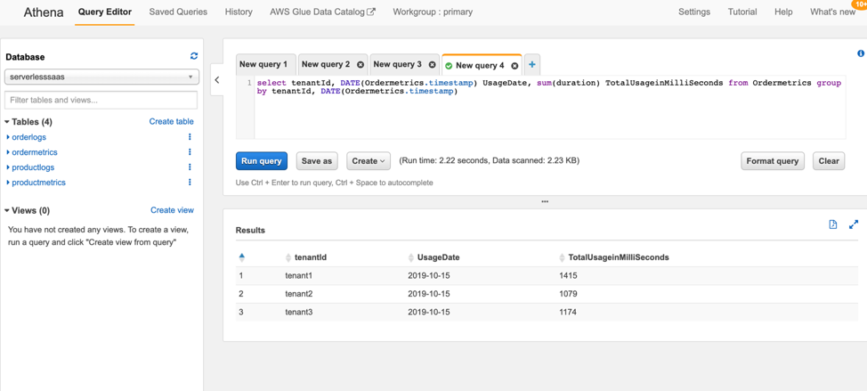

# Lab3 – Collect metrices using a metrics manager

Metrics are a fundamental tool that are used by SaaS organizations to get visibility into the activity, consumption, and operational patterns of your tenants. This very much follows the same pattern we used with the log manager in Lab 2. We’ll capture and publish metric data that will include tenant context. This will enable us to do downstream analytics on our metric data to make business and technical decisions. The additive piece of this is that we will need to instrument the code of our services with calls that identify and publish metrics. Naturally, this will be simplified version of metrics, but it will give you a sense of how this mechanism works and how publishing can be centralized and processed in a Lambda Layer.

<b>Step 1</b>: In Cloud9 IDE, Navigate to serverless-saas-layers -> Lab3 -> server -> layers -> nodejs

Add a new file in this folder and name it metrics-manager.js. Copy and paste the below code into the file.

```javascript
'use strict'

let helper = require('./helper.js');
const tokenManager = require('./token-manager.js');

// Recored metrics with no tenant context
module.exports.recordMetricEvent = function(event, eventSource, eventAction, context, currentDuration) {
    //Extract and Add tenant id to the message
    const tenantId = tokenManager.getTenantId(event);
    
    const metricEvent = {
        source: eventSource,
        type: "ApplicationService",
        action: eventAction,
        duration: currentDuration,
        timestamp: (new Date()).toISOString().substr(0, 19).replace('T',' '),
        tenantId: tenantId
    };
    
    const currentTime = Math.floor(new Date() / 1000).toString();
    const key = eventSource + '/' + currentTime;

    helper.uploadToS3(process.env.MetricsBucketName, key, JSON.stringify(metricEvent));
        
}
```
Now, save the file.

This module implements recordMetricEvent method which records action performed by the user, along with the duration of the action. It captures tenantId as well. 

<b>Step 2</b>: In this step, let’s see how we can change the data access layers to invoke the newly created metrics-manager.js file.

Open /server/order-manager/order-manager-dal.js file. Look for the “TODO” lines in the file and replace them with the below code.

```javascript
//TODO: Add call to metrics manager to log the metrics
const end = new Date().getTime();
metricsManager.recordMetricEvent(event, "OrderManager", "GetOrder", event, end - start);
```
For this to work, you need to also declare the “start” constant. A little exercise for you here - at the beginning of each method add a “const start” like the end constant. 
```javascript
cons start = new Date().getTime();
```
<b>Step 3</b>: Now let’s deploy this new code. To do so, change current directory to “serverless-saas-layers/Lab3” inside cloud9 Terminal window. Run the below two commands to deploy the cloud formation for this stack. Wait for this to finish. This will deploy our new multi-tenant metrics-manager.
```
chmod +x server_deploy.sh
. server_deploy.sh
```
<b>Step 4</b>: Now run the load_simulator.sh script using below two commands. Let this finish before proceeding. Follow the same process to get API Gateway URL as described in Lab1. The URL should be same as before. 
```
chmod +x load_simulator.sh
. load_simulator.sh <API GATEWAY URL> 
```
<b>Step 5</b>: We will now run the Athena queries to see the new metrics by tenant. Go to Athena, inside Services, and select “serverlesssaas” database from the database drop down on the left. Run below query to see usage for order service by tenantId.
```sql
select tenantId, DATE(Ordermetrics.timestamp) UsageDate, sum(duration) TotalUsageinMilliSeconds from Ordermetrics group by tenantId, DATE(Ordermetrics.timestamp)
```
<p align="center"><kbd></kbd></p>
Above query will provide the usage of order-manager service by each tenantId for each date recorded.

So far, we have seen how we can leverage Lambda layers to centralize multi-tenant logging and metrics collection. But our Product and Order tables inside DynamoDB has no tenant awareness at this point. In our next lab we will introduce you to the concept of Pool Vs Silo model of data storage and how DynamoDB can leverage those to partition data by tenant.

You have now completed Lab3. 

[Continue to Lab 4](../Lab4/README.md)


