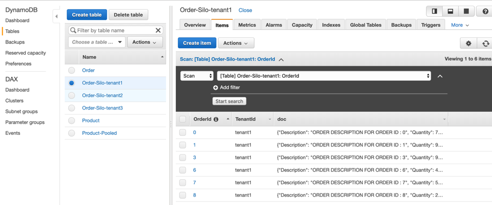
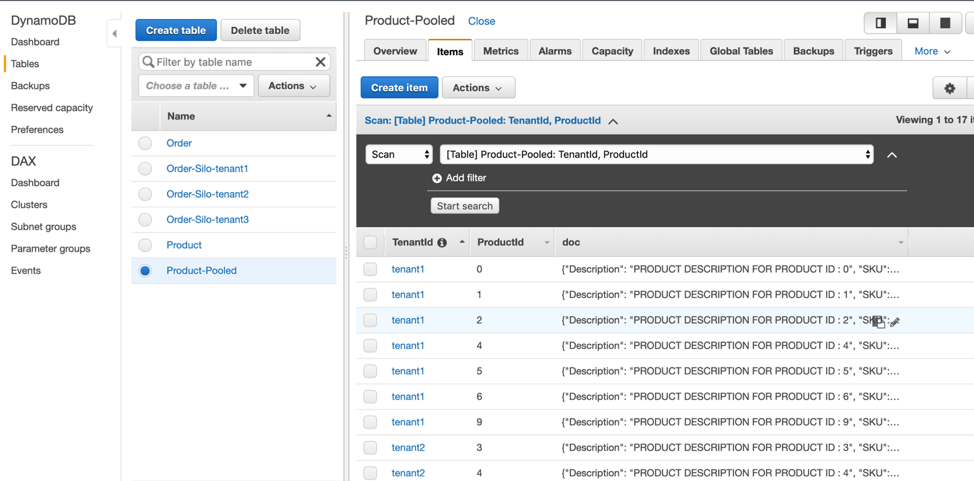

# Lab4 – Data partitioning using Silo and Pool model
Now that we’ve moved logging and metrics to use layers, we can start to think about what other aspects of our multi-tenancy could naturally move to a AWS Lambda Layer. One candidate could be data access. Generally, we’d like developers to not have visibility into how data might be partitioned for each tenant. One way to approach this is to introduce a separate partition manager that is accessed from your code to acquire the information needed to access a tenant’s data. So, if our data is in separate databases (a silo model) or using a shared database construct (a pool model), then we can make this entirely transparent to them by having this configuration managed outside the developer’s view. 

In our prior solution, each service had a data access layer that directly accessed the data. For this lab, we’ll introduce a new Data Partition Manager in a layer that will resolve the table name for a given tenant. The Data Access Layer of our services will be modified to make calls to this layer to resolve the name of the table that will be used.

<b>Step 1</b>: In the AWS Cloud9 IDE, Navigate to serverless-saas-layers -> Lab4 -> server -> layers -> nodejs -> partition-manager.js. Look at the partitionMap variable. We are using this variable to store service level configuration. In this case ProductService has Pool model, i.e. single table partitioned by tenantId. On the other hand, OrderService follows Silo model. 

Look at the getPartition method inside partition-manager. Order and Product services will now invoke this method in their data access layers to get the Table name. This method uses the configuration defined above to determine the data partitioning model. “createTenantProductTable” method creates the actual table based upon data partitioning strategy.

<b>Step 2</b>: Now, open /Lab4/server/order-manager/order-manager-dal.js file. Add references for token-manager and partition-manager in this file.
```javascript
const partitionManager = require('/opt/nodejs/partition-manager.js');
const tokenManager = require('/opt/nodejs/token-manager.js');
```
Now update the updateOrder method with the below code. Here we have implemented the call to partition-manager and look how the tableName is retrieved from the partition manager and not from the hardcoded definition within the file.
```javascript
// Add or update an order to DynamoDB 
module.exports.updateOrder = (event, callback) => {
    logManager.log(event, "OrderManager", {"Message": "DAL UpdateOrder() called.", "OrderId" : event.pathParameters.resourceId});

    const start = new Date().getTime();
    const tenantId = tokenManager.getTenantId(event);
    partitionManager.getPartition(event, partitionManager.ORDER_MANAGER, event.pathParameters.resourceId, function(tableName) {
        const item = {
            "TenantId": tenantId,
            "OrderId": event.pathParameters.resourceId,
            "doc": event.body
        };

        const params = {
            "TableName": tableName,
            "Item": item
        };

        dynamodb.putItem(params, (err) => {
            let response;
            if (err){
                console.log(err);
                response = createResponse(500, err);
            }
            else
                response = createResponse(200, null);
            
            const end = new Date().getTime();
            metricsManager.recordMetricEvent(event, "OrderManager", "UpdateOrder", event, end - start);            
            callback(response);
        });        
    });
};
```
Now, implement the above logic in the getOrder and deleteOrder methods, as well. Below is the new code for getOrder and deleteOrder.
```javascript
// Get an order from DynamoDB
module.exports.getOrder = function(event, callback) {
    logManager.log(event, "OrderManager", { "Message": "DAL GetOrder() called.", "OrderId" : event.pathParameters.resourceId});
    
    const start = new Date().getTime();
    const tenantId = tokenManager.getTenantId(event);
    partitionManager.getPartition(event, partitionManager.ORDER_MANAGER, event.pathParameters.resourceId, function(tableName) {
        let params;
        if (tableName.indexOf('Pooled') >=0){
            params = {
                "TableName": tableName,
                "Key": {
                    TenantId: tenantId,
                    OrderId: event.pathParameters.resourceId
                }
            };
        } else {
            params = {
                "TableName": tableName,
                "Key": {
                    OrderId: event.pathParameters.resourceId
                }
            }
        }

        dynamodb.getItem(params, (err, data) => {
            let response;
            if (err){
                console.log(err);
                response = createResponse(500, err);
            }
            else
                response = createResponse(200, data.Item ? data.Item.doc : null);

            const end = new Date().getTime();
            metricsManager.recordMetricEvent(event, "OrderManager", "GetOrder", event, end - start);
            callback(response);
        });   
    }); 
};
```
```javascript
// delete an order from DynamoDB 
module.exports.deleteOrder = (event, callback) => {
    logManager.log(event, "OrderManager", {"Message": "DAL deleteOrder() called.", "OrderId" : event.pathParameters.resourceId});
    
    const start = new Date().getTime();
    const tenantId = tokenManager.getTenantId(event);
    partitionManager.getPartition(event, partitionManager.ORDER_MANAGER, event.pathParameters.resourceId, function(tableName) {
        let params;
        if (tableName.indexOf('Pooled') >=0){
            params = {
                "TableName": tableName,
                "Key": {
                    TenantId: tenantId,
                    OrderId: event.pathParameters.resourceId
                }
            };
        } else {
            params = {
                "TableName": tableName,
                "Key": {
                    OrderId: event.pathParameters.resourceId
                }
            }
        }

        dynamodb.deleteItem(params, (err) => {
            let response;
            if (err){
                console.log(err);
                response = createResponse(500, err);
            }
            else
                response = createResponse(200, null);
            
            const end = new Date().getTime();
            metricsManager.recordMetricEvent(event, "OrderManager", "DeleteOrder", event, end - start);
            callback(response);
        });
    });
};
```
You can now delete the tableName and tableDefinition constants declared in order-manager-dal.js, since these are now coming from the partitionManager. 

Repeat the same process in /server/product-manager/product-manager-dal.js file. You can refer serverless-saas-layers/Solution/Lab4/server/product-manager/product-manager-dal.js, if needed.

<b>Step 3</b>: We will now deploy this new code and see this in action. To do so, change current directory to “serverless-saas-layers/Lab4” inside AWS Cloud9 Terminal window. Run the below two commands to deploy the cloud formation for this stack. Wait for this command to finish. 
```
chmod +x server_deploy.sh
. server_deploy.sh
```
<b>Step 4</b>: Now run the load_simulator.sh script using below commands. Let this finish before proceeding. Follow the same process to get Amazon API Gateway URL as described in Lab1. The URL should be same as before. 
```
chmod +x load_simulator.sh
. load_simulator.sh <API GATEWAY URL>
```
<b>Step 5</b>: Let’s now go to DynamoDB and see the tables created as part of this process. You will notice four new tables, namely, “Product-Pooled”, “Order-Silo-tenant1”, “Order-Silo-tenant2” and, “Order-Silo-tenant3”. 
<p align="center"><kbd></kbd></p>
Look at table structure of Product-Pooled table in the overview tab. Notice it has TenantId as partition key and ProductId as the sort key. On the other hand, we have individual tables for Order. As an example, Order-Silo-tenant1 stores data only for tenantId 1 and has OrderId as partition key.
<p align="center"><kbd></kbd></p>
<b>Step 6</b>: We can also change this data partitioning behavior by modifying our partitionMap variable, inside partition-manager.js. Change the Model for ProductManager to Silo and OrderManager to Pool. The new configuration should look like below:

```javascript
const partitionMap = new Map([
    ['ProductManager', 
        {'ServiceType': 'ProductService', 'Model': 'Silo', 'TableName': 'Product'}
    ],
    ['OrderManager', 
        {'ServiceType': 'OrderService', 'Model': 'Pool', 'TableName': 'Order'}
    ]
]);
```

<b>Step 7</b>: Go back to the terminal window and make sure you are still inside the Lab4 folder. Let’s now redeploy the new code and re-run the load simulator using below commands.
```
chmod +x server_deploy.sh
. server_deploy.sh
chmod +x load_simulator.sh
. load_simulator.sh <API GATEWAY URL>
```
<b>Step 8</b>: Go back to Amazon DynamoDB inside your console and notice that now Order has a table named as “Order-Pooled” and Product has tables for each tenant. This indicates that Order is now following the pooled data partitioning and Product is now in Silo model.

# Conclusion
We just saw how you can progressively add tenant isolation across various components of your application. Multi-tenancy is the key to a SaaS based application and hence it is important to architect your application keeping that in mind across both application and storage layers.
