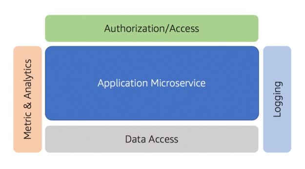

# Building Serverless SaaS with Lambda layers

## Introduction
One of the key goals of every software-as-a-service (SaaS) architect, is to create an environment where the complexity of multi-tenancy is largely hidden away from developers. The goal of this session is to introduce frameworks, libraries, and tooling that limits a developer’s need to have any awareness of tenant context. This will free up developers to focus on the features and functionality of their system. 

The general strategy applied here is to move all the code that accesses and applies tenant context into a set of libraries. These libraries are then referenced by each of the components/services in your environment. This is precisely where Lambda Layers comes into picture. In this Lab, we’ll look at how Lambda Layers allows you to centralize your tenant aware libraries without impact the size or load-time of your SaaS application’s functions.

### Hiding Away the Details of Multi-Tenancy
Before we dig into the Lambda Layers, we first need to understand what it means to hide away the details of multi-tenancy. Let’s start by looking at a common microservice that might be part of our SaaS environment. The figure below provides a high-level view of some of the common components that might be part of my service implementation.

<p align="center"></p>

Here you’ll notice that we have our microservice at the center of this diagram. Within this service resides all the business logic and functionality that is within the scope of the microservice. Surrounding it are examples of common constructs that would often be shared by any microservice that would be part of our system. Logging, for example, has been included here to represent the common library that will be used to capture and publish our log messages. The metrics and analytics library, as its name suggests, is used to record any metric data that is associated with the service. At the top of the service, you’ll also see authorization/access. This library is used to acquire tenant context from an incoming request and validate/scope the caller’s access to the service’s functionality. Finally, you’ll notice that we have a Data Access library here as well. This is a common construct for many systems that want to create a standardized model for interacting with the underlying storage and/or database that is used by this service.

So far, there’s nothing particularly distinguishing about this model. However, if you take these same services and place them in a multi-tenant environment, you will find that each one of these services must now incorporate support for tenant context.

In this session, we’ll build a solution that leverages layers to implement logging and metrics in a multi-tenant serverless environment. We’ll demonstrate the use of these layers and how reusable constructs can streamline the experience for SaaS developers.

## Setup Cloud9

If you are running this lab as part an AWS event, then the Cloud9 should already be setup in the AWS accounts provided to you by your instructor. Please skip this section if this is the case. 

If you are running this lab on your own, then follow these instructions to setup Cloud9 in your AWS account.

<b>Step 1</b>: Navigate to https://raw.githubusercontent.com/aws-samples/aws-serverless-saas-layers/master/Cloud9Setup/saas-cfn-cloud9-stack.yaml. This will display the contents of saas-cfn-cloud9-stack.yaml in your browser. 

<b>Step 2</b>: Copy the contents of this file and save in your local machine as a file by the name of saas-cfn-cloud9-stack.yaml.

<b>Step 3</b>: You can now use this yaml file to create a new stack in your AWS Account. Name the stack as “saas-cfn-cloud9-stack”. Alternatively, you can use below command, if you have AWS CLI installed on your machine. This will automatically deploy the stack and eventually setup Cloud9 for you.

```
aws cloudformation deploy --template-file saas-cfn-cloud9-stack.yaml --stack-name saas-cfn-cloud9-stack
```

## Lab1 – Starting with a single-tenant serverless solution

[](https://github.com/aws-samples/aws-serverless-saas-layers/blob/master/Lab1/README.md "Lab 1")

## Lab2 – Code re-usability and multi-tenancy using Lambda Layers 

[](https://github.com/aws-samples/aws-serverless-saas-layers/blob/master/Lab2/README.md "Lab 2")

## Lab3 – Collect metrices using a metrics manager

[](https://github.com/aws-samples/aws-serverless-saas-layers/blob/master/Lab3/README.md "Lab 3")

## Lab4 – Data partitioning using Silo and Pool model

[](https://github.com/aws-samples/aws-serverless-saas-layers/blob/master/Lab4/README.md "Lab 4")

## License

This library is licensed under the MIT-0 License. See the LICENSE file.